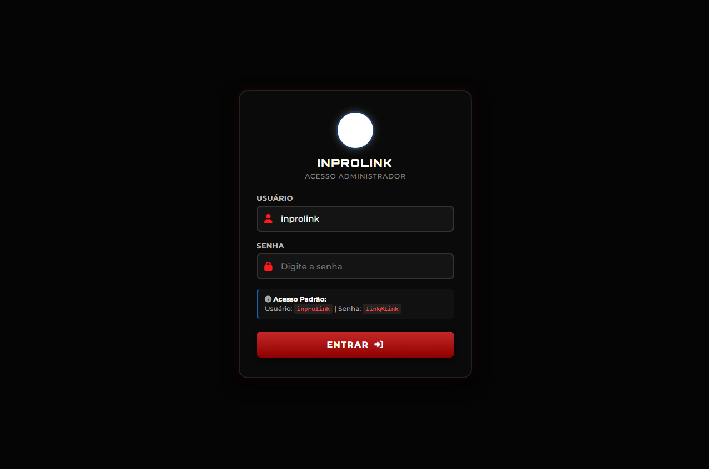
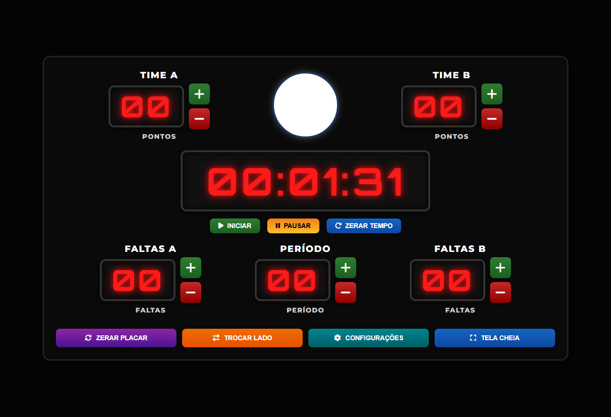

# 🏀 Inprolink System — Placar Eletrônico ESP32-S3

## 🖼️ Preview & Demonstração Login 

🔗 **Acesse o Login interativo:** [Live Demo - GitHub Pages](https://luiz0067yahoo.github.io/inprolink-scoreboard-esp32s3/demo/login.html)

## 🖼️ Preview & Demonstração Painel

🔗 **Acesse o painel interativo:** [Live Demo - GitHub Pages](https://luiz0067yahoo.github.io/inprolink-scoreboard-esp32s3/demo/painel.html)

Sistema embarcado para gerenciamento e controle de placar eletrônico esportivo composto por **16 dígitos independentes** de 7 segmentos em fita de LED **WS2812B** (5 LEDs por segmento, 35 LEDs por dígito, totalizando 560 LEDs).

O projeto combina uma interface web responsiva embarcada, resolução de nomes em rede local, persistência de dados em memória Flash (NVS) e atualização automática de placares através do consumo dinâmico de APIs JSON.

---

### 🌟 Destaques do Projeto

* **Controle Independente de 16 Dígitos:** Mapeamento dedicado de 16 saídas GPIO do ESP32-S3 para renderização de pontos, faltas, período e cronômetro.
* **Acesso Simplificado:** Navegação direta por endereço IP (`192.168.4.1`) ou hostname mDNS (`http://inprolink_system`).
* **Autenticação Embarcada:** Sistema de login com credenciais mestre e suporte a até 10 usuários adicionais salvos na memória NVS.
* **Consumo de API JSON:** Fluxo encadeado em 5 etapas para seleção automática da partida (Site → Modalidade → Campeonato → Partida → Rodada).
* **Reset de Fábrica Físico:** Restauração das configurações de fábrica mantendo a GPIO 0 pressionada por 5 segundos.

---

### 🔑 Credenciais Padrão e Acesso Inicial

Para o primeiro acesso ou após um reset de fábrica:

**1. Conexão Wi-Fi (Modo AP Inicial)**
* **SSID Wi-Fi:** `inprolink_system`
* **Senha Wi-Fi:** `too@ajw8i67`

**2. Acesso à Interface Web**
* **Endereço IP:** `http://192.168.4.1`
* **Hostname Direto:** `http://inprolink_system` (ou `http://inprolink_system.local`)

**3. Login de Administrador Padrão**
* **Usuário:** `inprolink`
* **Senha:** `link@link`

---

### 🔌 Mapeamento de Pinos (ESP32-S3 — 16 Dígitos)

Abaixo está o mapeamento dos 16 pinos de dados individuais para o placar com **2 dígitos de pontos** (00 a 99) para cada time:

| Módulo no Placar | Dígito | Função | Pino GPIO (ESP32-S3) |
| :--- | :--- | :--- | :--- |
| **Pontos Time A** (2 dígitos) | Dígito 1 | Dezena | GPIO 1 |
| | Dígito 2 | Unidade | GPIO 2 |
| **Pontos Time B** (2 dígitos) | Dígito 3 | Dezena | GPIO 3 |
| | Dígito 4 | Unidade | GPIO 4 |
| **Faltas Time A** (2 dígitos) | Dígito 5 | Dezena | GPIO 5 |
| | Dígito 6 | Unidade | GPIO 6 |
| **Período** (2 dígitos) | Dígito 7 | Dezena | GPIO 7 |
| | Dígito 8 | Unidade | GPIO 8 |
| **Faltas Time B** (2 dígitos) | Dígito 9 | Dezena | GPIO 9 |
| | Dígito 10 | Unidade | GPIO 10 |
| **Cronômetro** (6 dígitos / HH:MM:SS) | Dígito 11 | Horas (Dezena) | GPIO 11 |
| | Dígito 12 | Horas (Unidade) | GPIO 12 |
| | Dígito 13 | Minutos (Dezena) | GPIO 13 |
| | Dígito 14 | Minutos (Unidade) | GPIO 14 |
| | Dígito 15 | Segundos (Dezena) | GPIO 15 |
| | Dígito 16 | Segundos (Unidade) | GPIO 16 |
| **Reset Físico** | Botão | Reset NVS (Segurar 5s) | GPIO 0 (BOOT) |

---

### 📖 Manual de Configuração do Painel Web

**1. Alterar Conexão Wi-Fi e Acesso via Hostname**
1. Conecte-se à rede `inprolink_system` e acesse `http://inprolink_system`.
2. Faça login e navegue até a seção **Conexão Wi-Fi**.
3. Informe o **SSID** e a **Senha** do roteador local da quadra/ginásio.
4. Clique em **Salvar e Conectar**.
5. O ESP32-S3 se conectará ao roteador local. A partir desse momento, qualquer dispositivo na mesma rede poderá acessar o painel pelo endereço `http://inprolink_system.local`.

**2. Cadastro de até 10 Usuários no ESP32**
1. No painel principal, acesse a aba **Gestão de Usuários**.
2. Digite o **Nome do Usuário** e a **Senha**.
3. Clique em **Cadastrar Usuário**.
4. O usuário será gravado na partição NVS da memória Flash (limite máximo de 10 usuários armazenados).

**3. Passo a Passo Wizard para Cadastro da API (Atualização Automática)**
O assistente encadeado de 5 etapas vincula o placar ao servidor de campeonatos para atualizar o jogo via JSON:

* **Etapa 1 (URL Base):** Digite o endereço da API (ex: `https://api.meusite.com`) e clique em *Carregar Modalidades*.
* **Etapa 2 (Modalidade):** Selecione a modalidade do jogo (ex: *Futsal*, *Basquete*, *Vôlei*).
* **Etapa 3 (Campeonato):** Escolha o campeonato desejado na lista retornada.
* **Etapa 4 (Partida):** Selecione a partida que está sendo realizada.
* **Etapa 5 (Rodada):** Confirme a rodada atual e clique em **Salvar Automação**.

---

### 🔄 Reset Físico de Fábrica

Para apagar todas as redes salvas, usuários cadastrados e parâmetros de API:
1. Mantenha o botão conectado à **GPIO 0** pressionado por **5 segundos**.
2. Todas as partições NVS do ESP32-S3 serão apagadas.
3. O dispositivo reiniciará no modo Ponto de Acesso padrão (`inprolink_system`).

---

### ⚡ Especificações Elétricas e Montagem

* **Consumo por Dígito:** 35 LEDs × 60 mA = ~2,1 A por dígito em brilho máximo branco.
* **Consumo Médio em Operação:** ~8 A a 12 A em 5V DC (exibindo dígitos vermelhos).
* **Fonte Recomendada:** Fonte chaveada regulada 5V / 15A.
* **Sinal de Dados:** Resistor de **330 Ω** em série em cada linha GPIO.
* **GND Comum:** Interligar obrigatoriamente o GND da fonte de 5V ao GND do ESP32-S3.
