# 🏀 Inprolink System — Placar Eletrônico ESP32-S3


## 🖼️ Preview & Demonstração Login 

[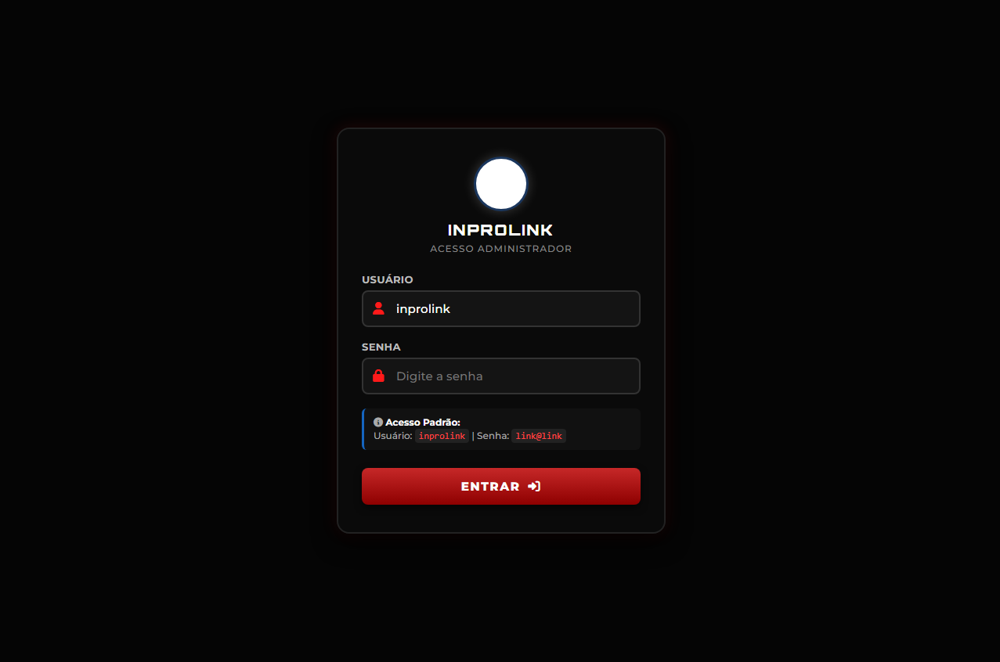](https://luiz0067yahoo.github.io/inprolink-scoreboard-esp32s3/demo/login.html)

🔗 **Acesse o Login interativo:** [Live Demo - GitHub Pages](https://luiz0067yahoo.github.io/inprolink-scoreboard-esp32s3/demo/login.html)


## 🖼️ Preview & Demonstração Cadastro Usuário 

[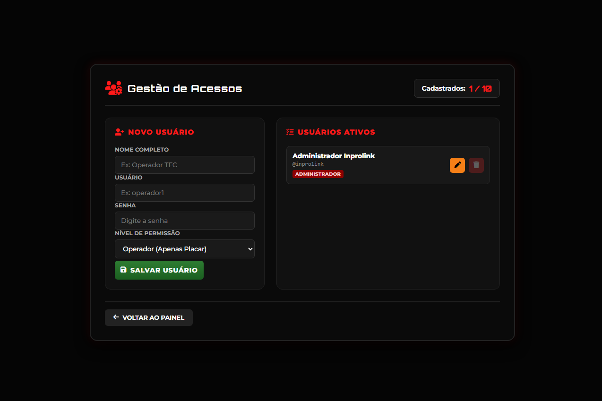](https://luiz0067yahoo.github.io/inprolink-scoreboard-esp32s3/demo/user_adm.html)

🔗 **Acesse o Cadastro Usuário interativo:** [Live Demo - GitHub Pages](https://luiz0067yahoo.github.io/inprolink-scoreboard-esp32s3/demo/user_adm.html)


## 🖼️ Preview & Demonstração Configuracao de rede 

[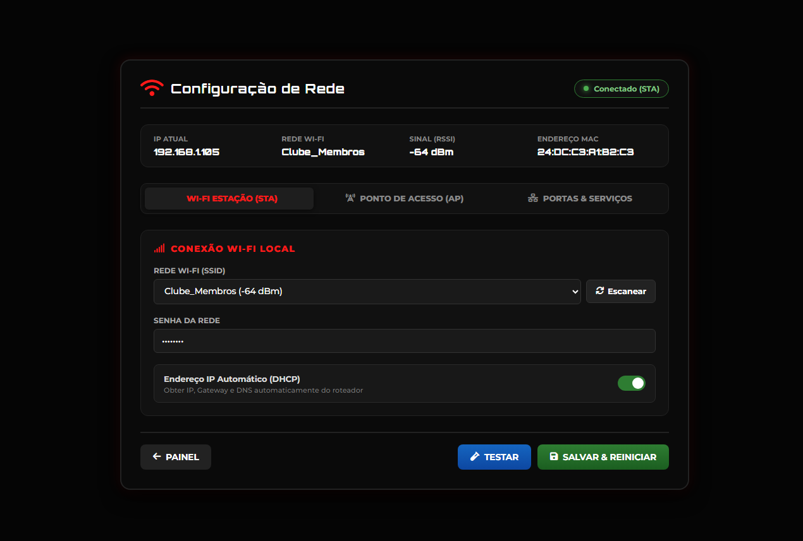](https://luiz0067yahoo.github.io/inprolink-scoreboard-esp32s3/demo/lan_config.html)

🔗 **Acesse o Configuracao de rede interativo:** [Live Demo - GitHub Pages](https://luiz0067yahoo.github.io/inprolink-scoreboard-esp32s3/demo/lan_config.html)


## 🖼️ Preview & Demonstração Painel

[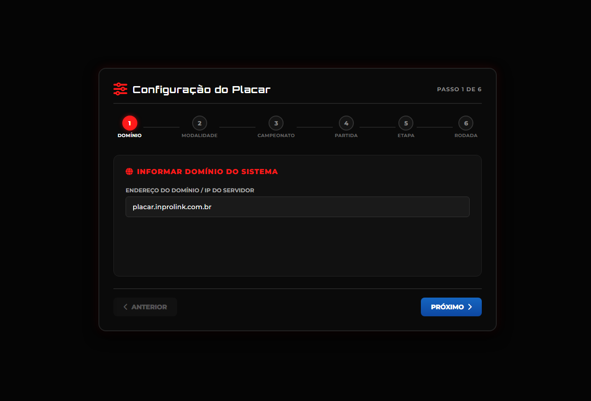](https://luiz0067yahoo.github.io/inprolink-scoreboard-esp32s3/demo/panel_config.html)
[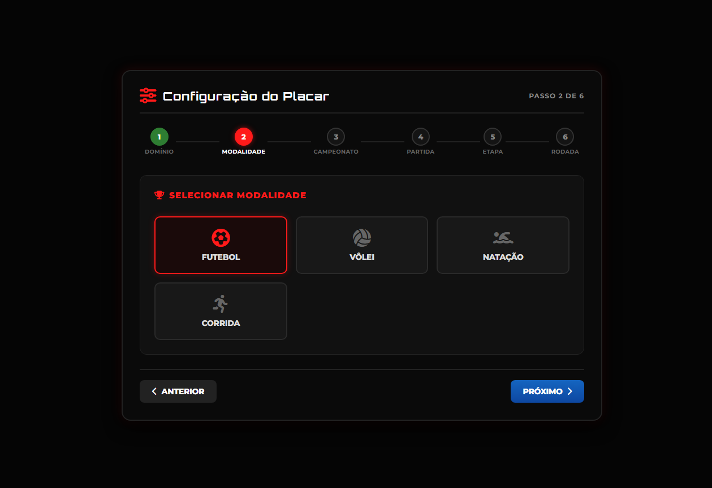](https://luiz0067yahoo.github.io/inprolink-scoreboard-esp32s3/demo/panel_config.html)
[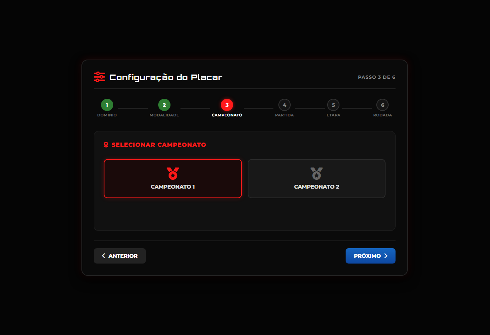](https://luiz0067yahoo.github.io/inprolink-scoreboard-esp32s3/demo/panel_config.html)
[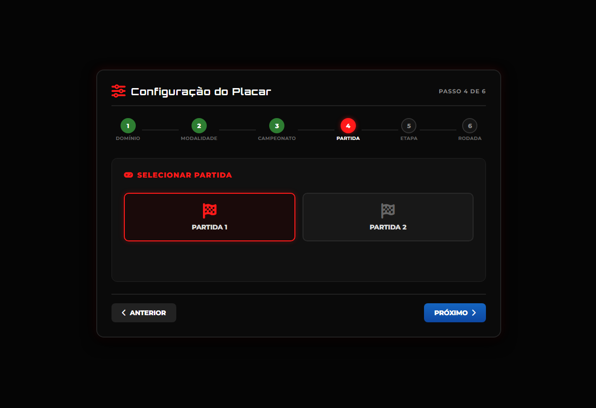](https://luiz0067yahoo.github.io/inprolink-scoreboard-esp32s3/demo/panel_config.html)
[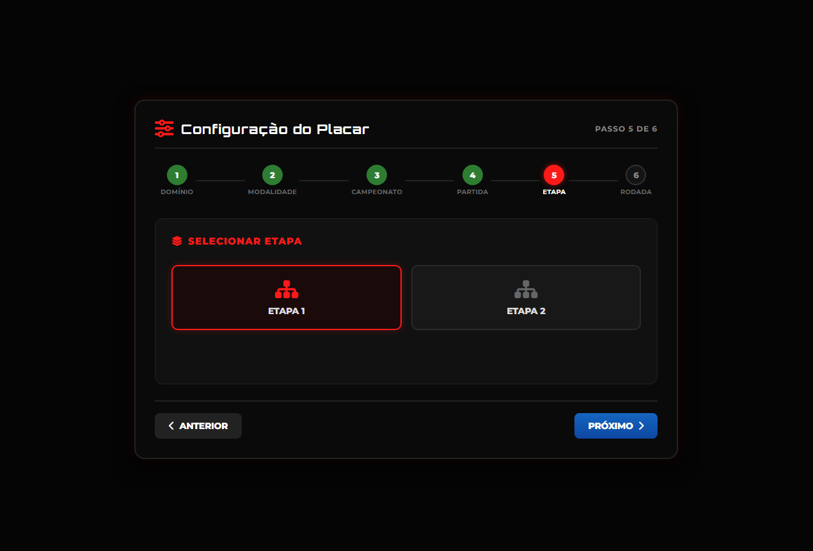](https://luiz0067yahoo.github.io/inprolink-scoreboard-esp32s3/demo/panel_config.html)
[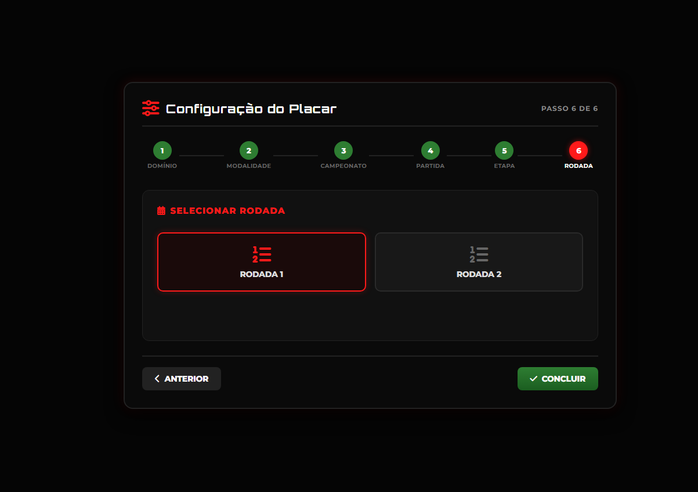](https://luiz0067yahoo.github.io/inprolink-scoreboard-esp32s3/demo/panel_config.html)

[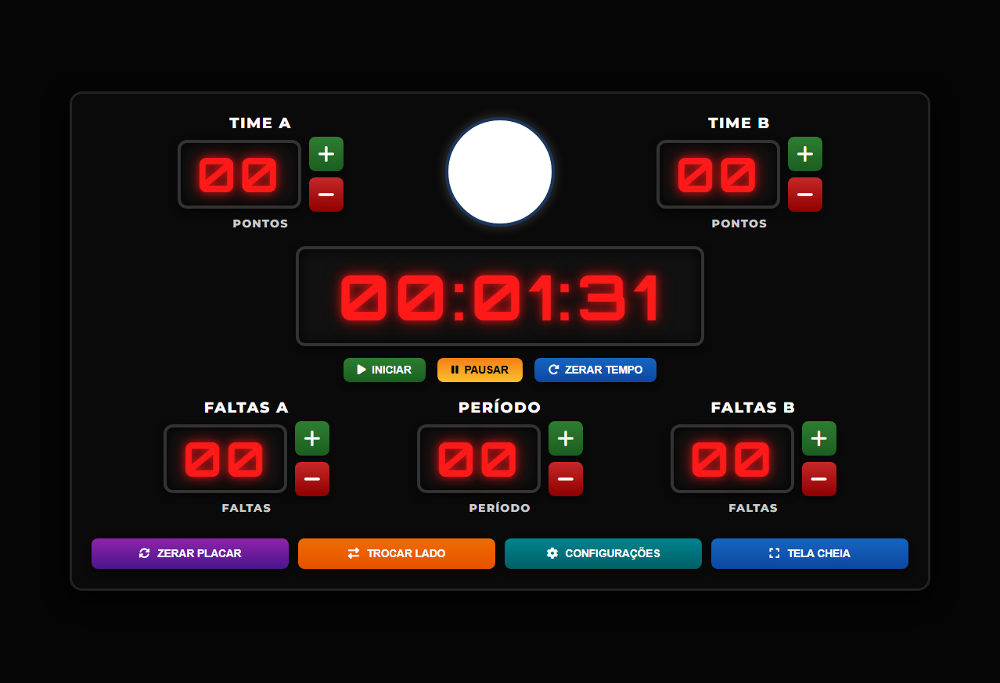](https://luiz0067yahoo.github.io/inprolink-scoreboard-esp32s3/demo/painel.html)

🔗 **Acesse o painel interativo:** [Live Demo - GitHub Pages](https://luiz0067yahoo.github.io/inprolink-scoreboard-esp32s3/demo/painel.html)

Sistema embarcado para gerenciamento e controle de placar eletrônico esportivo composto por **18 dígitos independentes** de 7 segmentos em fita de LED **WS2812B** / **FW-2812RGB** (5 LEDs por segmento, 35 LEDs por dígito, totalizando 630 LEDs).

O projeto combina uma interface web responsiva embarcada, resolução de nomes em rede local, persistência de dados em memória Flash (NVS) e atualização automática de placares através do consumo dinâmico de APIs JSON.

---

### 🌟 Destaques do Projeto

* **Controle Independente de 18 Dígitos:** Mapeamento dedicado de 18 saídas GPIO do ESP32-S3 para renderização de pontos (3 dígitos para Time A e 3 dígitos para Time B), faltas, período e cronômetro.
* **Acesso Simplificado:** Navegação direta por endereço IP (`192.168.4.1`) ou hostname mDNS (`http://inprolinksystem.local`).
* **Autenticação Embarcada:** Sistema de login com credenciais mestre e suporte a até 10 usuários adicionais salvos na memória NVS.
* **Consumo de API JSON:** Fluxo encadeado em 5 etapas para seleção automática da partida (Site → Modalidade → Campeonato → Partida → Rodada).
* **Reset de Fábrica Físico:** Restauração das configurações de fábrica mantendo a GPIO 0 pressionada por 5 segundos.

---

### 🔑 Credenciais Padrão e Acesso Inicial

Para o primeiro acesso ou após um reset de fábrica:

**1. Conexão Wi-Fi (Modo AP Inicial)**
* **SSID Wi-Fi:** `inprolinksystem`
* **Senha Wi-Fi:** `too@ajw8i67`

**2. Acesso à Interface Web**
* **Endereço IP:** `http://192.168.4.1`
* **Hostname Direto:** `http://inprolinksystem.local` (ou `http://192.168.4.1`)

**3. Login de Administrador Padrão**
* **Usuário:** `inprolink`
* **Senha:** `link@link`

---

### 📐 Diagrama de Segmentos (35 LEDs por Dígito)

<p align="center">
  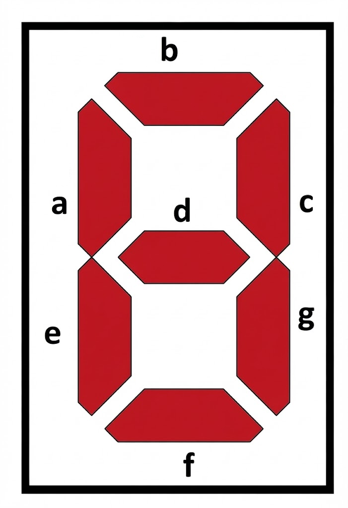
</p>

Cada dígito utiliza **7 segmentos** (a a g) e cada segmento contém **5 LEDs endereçáveis** ligados em série na seguinte ordem física:

* **Segmento `a` (LEDs 0 a 4):** Superior Esquerdo
* **Segmento `b` (LEDs 5 a 9):** Topo / Superior
* **Segmento `c` (LEDs 10 a 14):** Superior Direito
* **Segmento `d` (LEDs 15 a 19):** Meio / Centro
* **Segmento `e` (LEDs 20 a 24):** Inferior Esquerdo
* **Segmento `f` (LEDs 25 a 29):** Base / Inferior
* **Segmento `g` (LEDs 30 a 34):** Inferior Direito

```text
       Segmento b (5 LEDs)
       +---------------+
       |    bbbbbbb    |
 Seg a |               | Seg c
(5 LEDs)|               |(5 LEDs)
       |    ddddddd    |
       +---------------+  <-- Segmento d (5 LEDs)
       |               |
 Seg e |               | Seg g
(5 LEDs)|               |(5 LEDs)
       |    fffffff    |
       +---------------+
       Segmento f (5 LEDs)

 Total por Dígito = 7 segmentos x 5 LEDs = 35 LEDs WS2812B
```

#### 🔢 Tabela de Decodificação de Segmentos (0–9 e Hex A–F)

| Caractere | Segmentos Acesos | Máscara Binária | Hexadecimal |
| :---: | :--- | :---: | :---: |
| **0** | `a, b, c, e, f, g` | `0b01110111` | `0x77` |
| **1** | `c, g` | `0b01000100` | `0x44` |
| **2** | `b, c, d, e, f` | `0b00111110` | `0x3E` |
| **3** | `b, c, d, f, g` | `0b01101110` | `0x6E` |
| **4** | `a, c, d, g` | `0b01001101` | `0x4D` |
| **5** | `a, b, d, f, g` | `0b01101011` | `0x6B` |
| **6** | `a, b, d, e, f, g` | `0b01111011` | `0x7B` |
| **7** | `b, c, g` | `0b01000110` | `0x46` |
| **8** | `a, b, c, d, e, f, g` | `0b01111111` | `0x7F` |
| **9** | `a, b, c, d, f, g` | `0b01101111` | `0x6F` |
| **A** | `a, b, c, d, e, g` | `0b01011111` | `0x5F` |
| **b** | `a, d, e, f, g` | `0b01111001` | `0x79` |
| **C** | `a, b, e, f` | `0b00110011` | `0x33` |
| **d** | `c, d, e, f, g` | `0b01111100` | `0x7C` |
| **E** | `a, b, d, e, f` | `0b00111011` | `0x3B` |
| **F** | `a, b, d, e` | `0b00011011` | `0x1B` |

---

### 🔌 Diagrama de Conexão dos Pinos (ESP32-S3 — 18 Dígitos)

Abaixo está o diagrama completo das conexões de dados entre os pinos GPIO do ESP32-S3 e cada um dos 18 dígitos do placar:

```text
               +-----------------------+
               |  ESP32-S3 Controller  |
               +-----------------------+
                           |
  +------------------------+------------------------+
  | (Placar Time A)        | (Placar Time B)        |
  |-- GPIO 1 ---> Centena  |-- GPIO 4 ---> Centena  |
  |-- GPIO 2 ---> Dezena   |-- GPIO 5 ---> Dezena   |
  |-- GPIO 3 ---> Unidade  |-- GPIO 6 ---> Unidade  |
  +------------------------+------------------------+
  | (Faltas Time A)        | (Período)              |
  |-- GPIO 7 ---> Dezena   |-- GPIO 9 ---> Dezena   |
  |-- GPIO 8 ---> Unidade  |-- GPIO 10 --> Unidade  |
  +------------------------+------------------------+
  | (Faltas Time B)        | (Cronômetro HH:MM:SS)  |
  |-- GPIO 11 --> Dezena   |-- GPIO 13 --> Horas (D)|
  |-- GPIO 12 --> Unidade  |-- GPIO 14 --> Horas (U)|
  +------------------------|-- GPIO 15 --> Min (D)  |
                           |-- GPIO 16 --> Min (U)  |
                           |-- GPIO 17 --> Seg (D)  |
                           |-- GPIO 18 --> Seg (U)  |
                           +------------------------+
```

#### Tabela Detalhada de Pinos

| Módulo no Placar | Dígito | Posição / Função | Pino GPIO (ESP32-S3) | Qtd. LEDs |
| :--- | :--- | :--- | :--- | :--- |
| **Pontos Time A** (3 dígitos: 0-999) | Dígito 0 | **Centena** | `GPIO 1` | 35 LEDs |
| | Dígito 1 | **Dezena** | `GPIO 2` | 35 LEDs |
| | Dígito 2 | **Unidade** | `GPIO 3` | 35 LEDs |
| **Pontos Time B** (3 dígitos: 0-999) | Dígito 3 | **Centena** | `GPIO 4` | 35 LEDs |
| | Dígito 4 | **Dezena** | `GPIO 5` | 35 LEDs |
| | Dígito 5 | **Unidade** | `GPIO 6` | 35 LEDs |
| **Faltas Time A** (2 dígitos: 0-99) | Dígito 6 | Dezena | `GPIO 7` | 35 LEDs |
| | Dígito 7 | Unidade | `GPIO 8` | 35 LEDs |
| **Período** (2 dígitos: 0-99) | Dígito 8 | Dezena | `GPIO 9` | 35 LEDs |
| | Dígito 9 | Unidade | `GPIO 10` | 35 LEDs |
| **Faltas Time B** (2 dígitos: 0-99) | Dígito 10 | Dezena | `GPIO 11` | 35 LEDs |
| | Dígito 11 | Unidade | `GPIO 12` | 35 LEDs |
| **Cronômetro** (6 dígitos / HH:MM:SS) | Dígito 12 | Horas (Dezena) | `GPIO 13` | 35 LEDs |
| | Dígito 13 | Horas (Unidade) | `GPIO 14` | 35 LEDs |
| | Dígito 14 | Minutos (Dezena) | `GPIO 15` | 35 LEDs |
| | Dígito 15 | Minutos (Unidade) | `GPIO 16` | 35 LEDs |
| | Dígito 16 | Segundos (Dezena) | `GPIO 17` | 35 LEDs |
| | Dígito 17 | Segundos (Unidade) | `GPIO 18` | 35 LEDs |
| **Reset Físico NVS** | Botão | Pressionar por 5s | `GPIO 0` (BOOT) | — |

---

### 📖 Manual de Configuração do Painel Web

**1. Alterar Conexão Wi-Fi e Acesso via Hostname**
1. Conecte-se à rede `inprolinksystem` e acesse `http://inprolinksystem.local`.
2. Faça login e navegue até a seção **Conexão Wi-Fi**.
3. Informe o **SSID** e a **Senha** do roteador local da quadra/ginásio.
4. Clique em **Salvar e Conectar**.
5. O ESP32-S3 se conectará ao roteador local. A partir desse momento, qualquer dispositivo na mesma rede poderá acessar o painel pelo endereço `http://inprolinksystem.local`.

**2. Cadastro de até 10 Usuários no ESP32**
1. No painel principal, acesse a aba **Gestão de Usuários**.
2. Digite o **Nome do Usuário** e a **Senha**.
3. Clique em **Cadastrar Usuário**.
4. O usuário será gravado na partição NVS da memória Flash (limite máximo de 10 usuários armazenados).

**3. Passo a Passo Wizard para Cadastro da API (Atualização Automática)**
O assistente encadeado de 5 etapas vincula o placar ao servidor de campeonatos para atualizar o jogo via JSON:

* **Etapa 1 (URL Base):** Digite o endereço da API (ex: `https://api.meusite.com`) e clique em *Carregar Modalidades*.
* **Etapa 2 (Modalidade):** Selecione a modalidade do jogo (ex: *Futsal*, *Basquete*, *Vôlei*).
* **Etapa 3 (Campeonato):** Escolha o campeonato desejado na lista retornada.
* **Etapa 4 (Partida):** Selecione a partida que está sendo realizada.
* **Etapa 5 (Rodada):** Confirme a rodada atual e clique em **Salvar Automação**.

---

### 🔄 Reset Físico de Fábrica

Para apagar todas as redes salvas, usuários cadastrados e parâmetros de API:
1. Mantenha o botão conectado à **GPIO 0** pressionado por **5 segundos**.
2. Todas as partições NVS do ESP32-S3 serão apagadas.
3. O dispositivo reiniciará no modo Ponto de Acesso padrão (`inprolinksystem`).

---

### ⚡ Especificações Elétricas e Montagem

* **Consumo por Dígito:** 35 LEDs × 60 mA = ~2,1 A por dígito em brilho máximo branco.
* **Consumo Total Máximo:** 630 LEDs × 60 mA = ~37,8 A em 5V DC (todos LEDs acesos em Branco 100%).
* **Consumo Médio em Operação:** ~10 A a 15 A em 5V DC (exibindo dígitos coloridos).
* **Fonte Recomendada:** Fonte chaveada regulada 5V / 20A ou superior.
* **Sinal de Dados:** Resistor de **330 Ω** em série em cada linha GPIO para proteção de sinal.
* **GND Comum:** Interligar obrigatoriamente o GND da fonte de 5V ao GND do ESP32-S3.

